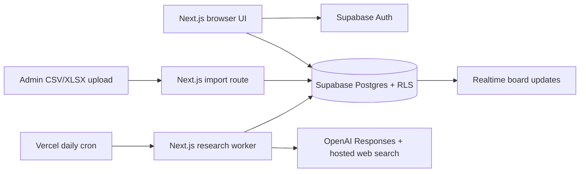
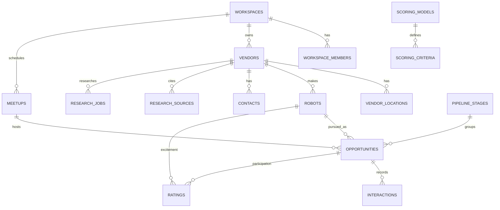

# RMAIIG Robots

A shared workspace for ranking humanoid robots and organizing manufacturer outreach for in-person Meetups in Boulder, Colorado. The 2026 Technophilosoph sheet is an import source; Supabase is the operational record. Research findings retain source links and human ratings remain separate from AI suggestions.

## Architecture





## Local setup

Requires Node.js 24, pnpm 11, a Supabase project, and the variables in [.env.example](.env.example). The publishable key is browser safe only because operational tables have workspace Row Level Security. Keep `SUPABASE_SECRET_KEY`, `OPENAI_API_KEY`, and `CRON_SECRET` server only.

```sh
pnpm install --frozen-lockfile
cp .env.example .env.local
pnpm dev
```

The migrations in `supabase/migrations/` create the schema, RLS policies, scoring models, Boulder Meetup, stages, and email templates. Link the Supabase CLI to the intended project, then run `supabase db push`. Regenerate database types after schema changes with `supabase gen types typescript --linked --schema public > src/lib/database.types.ts`. Never use `db reset` against production.

An authenticated user needs a `workspace_members` row before they can see data. Users sign in with an email magic link or a passkey. A signed-in account with no profile name is prompted for first and last name, then can wait for workspace approval. New nonmember requests appear in Administration, where an admin can approve them as members or deny them. Admins receive a notification email through the `notify-access-request` Supabase Edge Function when a request is first recorded. Configure `RESEND_API_KEY` and a verified `RESEND_FROM_EMAIL` sender as Supabase Edge Function secrets; email credentials do not belong in Vercel. Supabase Auth must have Passkeys enabled and configured for the production domain under Authentication → Passkeys. The first user can follow the magic link, then be provisioned by a database administrator using that user's `auth.users.id`:

```sql
insert into public.workspace_members (workspace_id, user_id, role)
values ('c02ee290-4f87-4d1f-98c1-24c502126086', '<auth-user-uuid>', 'admin');
```

Membership rows, rather than editable user metadata, determine access. After the first admin is provisioned, that admin can approve access requests, add already registered users by email and name, change roles, and remove members in Administration. Owner and collaborator assignments display profile names. The database prevents removal of the last admin. Members edit operational records, and viewers read. RLS was transaction-tested for admin, member, viewer, and nonmember.

## Source import

The original values and row numbers from [2026 Robots from Technophilosoph](https://docs.google.com/spreadsheets/d/1O_XGuLpRxLJMRVMqZaH0PeMhXXtPDSAb7uRMZnYA-30/edit?usp=drivesdk) are saved in `data/technophilosoph-2026.json`. The live Supabase project contains 275 vendors and 345 robot records from 275 manufacturer rows. Four combined robot-name cells require manual parsing review; they were preserved without inventing model records. Empty robot-name cells still created vendors.

Admins can preview and commit a later CSV or XLSX file on the Administration screen. Headers must match the original four columns exactly. The importer deduplicates normalized names, logs batches, queues new vendors, and creates opportunities for identifiable robots in existing Meetups. CLI dry run: `pnpm import data/technophilosoph-2026.json`; commit: add `--commit`. The CLI needs the server key in `.env.local`. Review warnings first. Import updates omit manually enriched fields.

## Scoring and outreach

Each rating has separate AI and manual fields. The manual value wins when present; missing values do not become zero. The available ratings are normalized to a 0–100 score:

`100 × Σ(weight × effective_rating / 5) ÷ Σ(weight for rated criteria)`

Coverage is the sum of rated weights. Scores below the workspace threshold (60% by default) show **Provisional** and cannot yield combined priority. When both components qualify, priority is `excitement × participation / 100`. Admin weight changes require exactly 100% and create a new model version without changing ratings. Participation interpretations are planning estimates, not measured probabilities.

The board uses ten seeded stages. Moving a card persists the stage and writes stage history. Realtime reloads collaborator changes. Email templates merge contact and opportunity fields, warn about unresolved placeholders, and allow editing and copying. Copying does not log an email; **Log as sent** records an interaction only after confirmation. The app does not send email.

## Research queue and cost controls

Each imported vendor has a persistent research job. Vercel cron calls `/api/research/process` daily with `Authorization: Bearer $CRON_SECRET`. The worker uses OpenAI Responses, hosted `web_search`, and Zod-validated structured output. `OPENAI_MODEL` defaults to `gpt-5.6-terra`, checked against OpenAI's current model and API documentation during implementation. Configure `OPENAI_API_KEY` to enable it. Interrupted jobs requeue after 30 minutes; failures retry with bounded backoff. `RESEARCH_BATCH_SIZE`, `RESEARCH_CONCURRENCY`, and `RESEARCH_MAX_JOBS_PER_DAY` cap work. These are job counts, not currency limits; track spend in OpenAI usage.

Initial enrichment used sourced manual research because no OpenAI key was available: ten US vendors have partial research, with source records, US locations where found, a few public professional contacts, and suggested scoring evidence for three robots. Most jobs remain queued. Source links appear on record pages. An inferred email must never be presented as confirmed.

## Verification and deployment

```sh
pnpm lint
pnpm typecheck
pnpm test
pnpm build
git diff --check
```

The connected Vercel project is `rmaiig-robots`; its intended production URL is [rmaiig-robots.vercel.app](https://rmaiig-robots.vercel.app/). Configure the variables from `.env.example` for production, especially the Supabase browser URL/key and server-only secret key. Research additionally needs `OPENAI_API_KEY` and `CRON_SECRET`. Configure `RESEND_API_KEY` and `RESEND_FROM_EMAIL` as Supabase Edge Function secrets for access notifications. GitHub `main` is connected to the existing Vercel project. Push a verified commit to deploy; inspect build logs and load the production URL before considering it live. Add the production URL to Supabase Auth's redirect allow list. Apply pending database migrations before deploying code that depends on their schema.

## Current limits

The initial import is complete, but most research is queued. No real user has been provisioned, so the authenticated workflow needs a first admin account and a browser acceptance pass. List views load 100 records at a time; global search shows the first 50 matches per category and asks users to narrow broad searches. The worker preserves returned web-search sources and inline citation metadata, but has not run with an OpenAI key. These limits need resolution before relying on the app as a fully operated production system.
